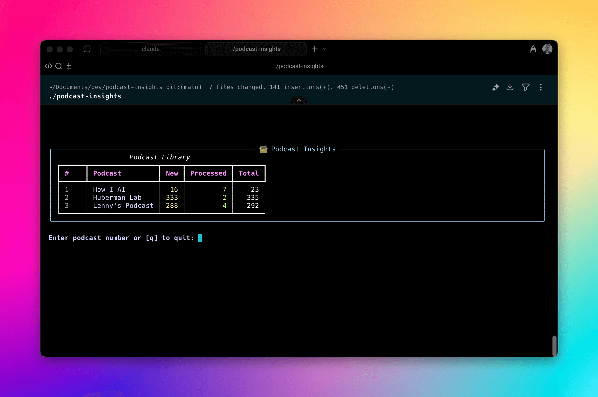

# Podcast Insights

An interactive terminal application for browsing podcast RSS feeds, downloading episodes, transcribing audio to Markdown, and extracting insights — all on your Mac.



## Features

- 📻 Browse multiple podcast RSS feeds in a clean terminal interface
- 📥 Download and process episodes on-demand
- 📝 Transcribe audio to Markdown using local ML models
- 🧠 Extract key insights using AI
- 💾 Local storage with organized folder structure
- 🎯 Process any episode from any point in the feed history

## Requirements

- macOS/Linux with Python 3.10+ (3.13 recommended)
- ffmpeg installed (for transcription)
- Git (for automatic installation)
- API key for OpenAI or Anthropic/Claude

## Installation

You can install Podcast Insights using either the automatic setup (recommended) or manual installation.

### Quick Start (Automatic Installation)

```bash
# Clone with submodules
git clone --recursive https://github.com/michaeldiestelberg/podcast-insights.git
cd podcast-insights

# Run interactive setup
./setup.sh
```

The setup wizard will:
- Install bundled transcription and AI tools
- Configure your API keys (OpenAI/Anthropic)
- Help you select an AI model
- Optionally add RSS feeds
- Generate your configuration file

### Manual Installation

For advanced users who want to use existing tool installations:

1. **Clone all three repositories separately:**
```bash
git clone https://github.com/michaeldiestelberg/podcast-insights.git
git clone https://github.com/michaeldiestelberg/ai-cli.git
git clone https://github.com/michaeldiestelberg/local-podcast-transcription.git
```

2. **Set up each tool individually:**
   - Follow setup instructions in each repository
   - Configure ai-cli with your API keys in `.env`
   - Ensure transcription tool dependencies are installed

3. **Configure Podcast Insights:**
```bash
cd podcast-insights
cp config.example.yaml config.yaml
# Edit config.yaml with:
#   - Paths to your transcribe.sh and ai-prompt tools
#   - Your preferred AI model
#   - RSS feed URLs
```

4. **Run the application:**
```bash
./podcast-insights
```

**Alternative:** Run `./setup.sh` and choose manual mode (option 2) to have the wizard help you configure paths and API keys interactively.

## Usage

Launch the application:
```bash
./podcast-insights
```

Update bundled tools to latest versions:
```bash
./podcast-insights --update
# Or directly:
./update.sh
```

The wrapper script automatically:
- Creates a Python virtual environment
- Installs dependencies
- Launches the interface

### Navigation

**Main Screen:**
- Browse your configured podcasts
- See episode counts (new/processed)
- Type number + Enter to select a podcast

**Episode List:**
- View episodes with processing status
- Type number + Enter to select an episode
- Select multiple: `1,3,5` (comma-separated), `1-5` (range), or `all`
- Press `l` to load more episodes
- Press `ESC` to go back
- Press `q` to quit

**Processing Modes:**
After selecting episode(s), choose a processing mode:
- **[1] Full processing**: Download + Transcribe + Extract insights
- **[2] Transcribe only**: Download + Transcribe (no insights - saves API costs)
- **[1] Extract insights**: For already-transcribed episodes, add insights later

**Bulk Processing:**
- Select multiple episodes with ranges or "all"
- Episodes are processed sequentially
- Compact progress UI shows current episode and completion count
- Skipped episodes (already done) are shown before processing

**Processing View:**
- Watch real-time progress through the selected stages
- Results are saved to the data directory

## Configuration

### AI Model Selection

You can change the AI model anytime by editing `config.yaml`:

```yaml
tools:
  insights_cmd: "... --model gpt-5-mini"  # Change model here
```

**Available models:**
- **OpenAI:** gpt-5, gpt-5-mini (default), gpt-5-nano, gpt-4o, gpt-4o-mini
- **Anthropic:** claude-opus-4-1, claude-sonnet-4, claude-haiku-3-5, claude-sonnet-3-5

### API Keys

API keys are stored in `tools/ai-cli/.env` (or your custom ai-cli location):
```bash
# Edit API keys
vi tools/ai-cli/.env
```

### config.yaml Structure

```yaml
storage:
  data_dir: ./data        # Where to save episodes
  temp_dir: ./data/_tmp   # Temporary download location

runtime:
  max_retries: 3          # Download retry attempts
  retry_backoff_seconds: 5

tools:
  # Automatically configured by setup.sh
  transcribe_cmd: "/path/to/transcribe.sh \"{audio}\" -o \"{transcript}\""
  insights_cmd: "/path/to/ai-prompt --prompt \"{transcript}\" --system-prompt podcast-insights --output-path \"{episode_dir}\" --output-name \"{insights_file}\" --model gpt-5-mini"

feeds:
  - url: https://example.com/podcast.rss
    name: Example Podcast
```

### Finding RSS Feeds

To find RSS feed URLs for your favorite podcasts:
1. Visit [pod.link](https://pod.link/)
2. Search for your podcast by name
3. CCopy the feed URL (in the ... menu)
4. Add it to your `config.yaml`

### Storage Layout

Episodes are organized by podcast and date:
```
data/
  PodcastName/
    2024-01-15_EpisodeTitle/
      EpisodeTitle.mp3
      EpisodeTitle.transcript.md
      EpisodeTitle.insights.md
```

## First Run

On first use:
- Run `./setup.sh` to configure everything interactively
- The app fetches all episodes from your configured feeds
- Browse any episode from the full history
- Process episodes on-demand as needed
- The transcription tool may download ML models (one-time ~500MB)

## Troubleshooting

**Missing dependencies:**
- Install ffmpeg: `brew install ffmpeg`
- Ensure Python 3.10+: `python3 --version`

**Config not found:**
- Run `./setup.sh` to generate configuration
- Or manually create from `config.example.yaml`

**API key issues:**
- Check keys in `tools/ai-cli/.env`
- Get OpenAI key: https://platform.openai.com/api-keys
- Get Anthropic key: https://console.anthropic.com/settings/keys

**Tools not working:**
- Update tools: `./podcast-insights --update`
- Verify tool paths in config.yaml
- Test tools directly with their documentation

**No episodes showing:**
- Check feed URLs are correct
- Ensure internet connection for initial feed fetch

## Development

Built with:
- Python 3.10+ for core logic
- Rich library for terminal UI
- SQLite for episode tracking
- External tools for transcription and insights

### Project Structure
- `podcast_insights.py` - Main application and TUI controller
- `database.py` - Database operations
- `models.py` - Configuration and state dataclasses
- `utils.py` - Helper functions and utilities
- `processors.py` - Feed and episode processing logic
- `ui_components.py` - UI rendering components
- `config_manager.py` - Configuration management and auto-detection
- `setup.sh` - Interactive setup wizard
- `update.sh` - Tool update script
- `tools/` - Bundled tools (git submodules)

## License

MIT